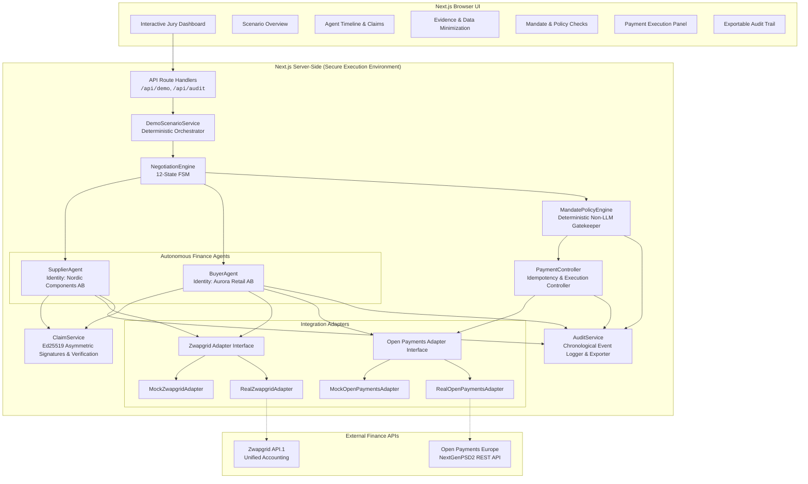
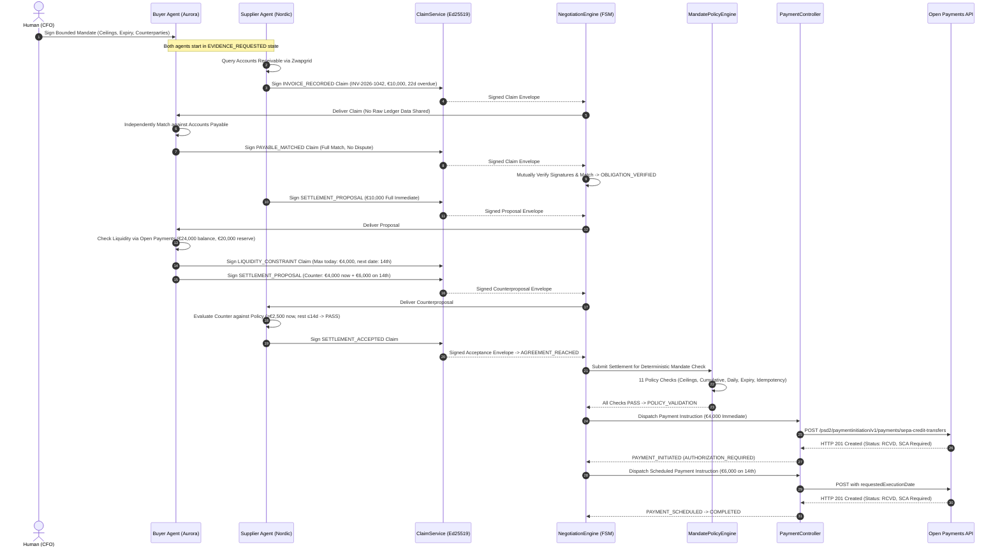

# Settlement Network — Architecture

Settlement Network is a hackathon-grade autonomous finance agent protocol where two policy-constrained agents negotiate and execute settlement of overdue B2B invoices.

## High-Level Architecture

## Negotiation Protocol Sequence Diagram

